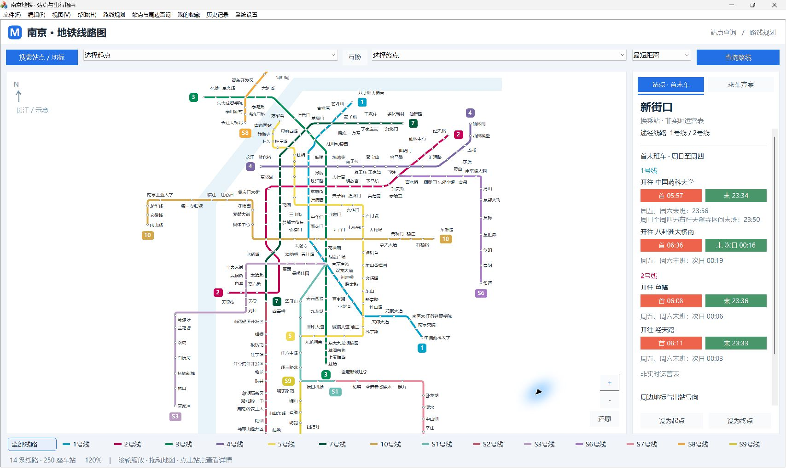

# 南京地铁换乘查询 NanjingMetro

一个基于 **MFC（Microsoft Foundation Classes）** 开发的南京地铁线路换乘查询桌面程序。

项目作为课程设计项目开发，主要实现南京地铁线网建模、站点搜索、路径规划、换乘方案查询、首末班车查询、历史记录以及地铁线路图可视化等功能。



---

## 项目简介

NanjingMetro 是一个基于 C++ / MFC 开发的 Windows 桌面应用程序，
用于模拟南京地铁线路查询与换乘规划。

项目将南京地铁线网抽象为图结构，以站点作为节点、相邻站点之间的区间作为边，
在此基础上实现站点搜索与路径规划，并结合自定义地图布局完成南京地铁线网的可视化展示。

---

## 线网规模

当前版本内置：

- **14 条地铁线路**
- **250 个站点**
- **31 个换乘站**
- **269 个区间**
- **538 条首末班车时刻记录**

覆盖线路：

`1号线、2号线、3号线、4号线、5号线、7号线、10号线、S1号线、S2号线、S3号线、S6号线、S7号线、S8号线、S9号线`

> 项目中的线路及运营数据为当前版本内置数据，具体运营信息请以南京地铁官方发布的信息为准。

---

## 主要功能

### 1. 站点搜索

支持根据站点名称快速搜索地铁站，并进行起点、终点选择。

### 2. 路径规划

基于图结构建立南京地铁线网模型，通过 `MetroGraph` 与 `RouteStrategy`
完成两站之间的路径计算。

查询结果可以展示：

- 经过站点
- 换乘线路
- 换乘次数
- 预计耗时
- 推荐乘车方案

### 3. 首末班车查询

通过 `ServiceTimetable` 管理各线路首末班车信息，
支持查询不同线路的首班车与末班车时间。

### 4. 历史记录

通过 `HistoryManager` 管理用户历史查询记录，
支持历史路线的保存与查看。

### 5. 南京地铁线路图可视化

根据南京地铁官方线路图重新建立地图布局，
对 14 条线路进行统一绘制。

实现：

- 线路绘制
- 站点绘制
- 换乘站显示
- 站名自动避让
- 路线高亮
- 线路淡化
- 地图缩放
- 地图拖动
- 地图还原

### 6. 集成测试

项目提供 `IntegrationTests` 工程，
用于验证：

- 路径计算
- 地图坐标
- 换乘关系
- 路线高亮
- 正反向查询

最近一次完整验证：

**5,244,977 项检查通过，187,500 次路线查询通过。**

---

## 技术实现

### 开发语言

- C++
- MFC
- Win32

### 核心技术

- 图结构建模
- 路径搜索
- 换乘策略计算
- 自定义地图坐标系统
- MFC 对话框与控件
- GDI / 自定义绘图
- 文件数据解析
- 本地数据管理
- 集成测试

---

## 项目结构

```text
NanjingMetro/
├── README.md
├── LICENSE
├── 构建.ps1
├── 可运行程序/
│   ├── NanjingMetro.exe
│   ├── metro_data.txt
│   └── service_times.txt
├── 界面对照/
│   ├── 00_用户提供的南京地铁原图.jpg
│   ├── 01_原图对齐全网.png
│   └── 02_统一圆点放大视图.png
└── 源码/
    └── NanjingMetro/
````

---

## 核心源码

| 文件                    | 作用                 |
| --------------------- | ------------------ |
| `OfficialMapLayout.h` | 地铁线路显示坐标与站间转折点     |
| `MetroLayout.h`       | 地图底图、站点命中与路线高亮共用几何 |
| `MapLabelLayout.h`    | 站名位置与自动避让          |
| `MapStyle.h`          | 地图绘制样式与绘图原语        |

---

## 环境要求

* Windows 10 / 11
* Visual Studio 2017 及以上
* C++ 桌面开发
* MFC
* PowerShell 5.1+

最近一次验证环境：

```text
Visual Studio 2022
v143
Windows SDK 10.0.26100.0
Release x64
```

---

## 构建

在项目根目录打开 PowerShell：

```powershell
# Release
.\构建.ps1

# Debug
.\构建.ps1 -Configuration Debug

# 构建并运行集成测试
.\构建.ps1 -Test
```

---

## 直接运行

如果不需要自行编译，可以直接运行：

```text
可运行程序/NanjingMetro.exe
```

运行时需要确保：

```text
NanjingMetro.exe
metro_data.txt
service_times.txt
```

位于同一目录。

---

## 项目亮点

本项目不仅实现了基本的地铁查询功能，还重点进行了以下设计：

1. **将真实地铁线网抽象为图结构**
2. **将路径规划与地图可视化进行分离**
3. **建立独立的地图坐标布局系统**
4. **实现站名自动避让**
5. **支持路线查询后的地图高亮**
6. **对路径计算与地图显示进行集成测试**
7. **使用真实南京地铁线网数据进行验证**

---

## 许可

本项目源代码采用 **NanjingMetro Non-Commercial License v1.0**。

本项目允许个人学习、教育、学术研究以及非商业用途的使用和修改。

未经版权所有者书面许可，禁止将本项目用于商业销售、商业部署、
商业服务或其他以商业获利为目的的用途。

如需商业使用或商业授权，请联系项目作者。

完整许可条款请参见仓库根目录下的 [`LICENSE`](LICENSE) 文件。

### 第三方资源

本项目部分线路数据、首末班车数据、地图参考资料、图片、字体、
图标或其他资源可能来源于第三方。

第三方资源的版权及其他权利归相应权利人所有，
不因本项目采用上述许可证而获得额外授权。
使用相关资源时，请遵循其原始许可证及相关规定。
---

## 作者

**UART234**

南京地铁换乘查询课程设计项目

2026

This project is publicly available for viewing and non-commercial use.
Commercial rights are reserved by the copyright holder.
````
